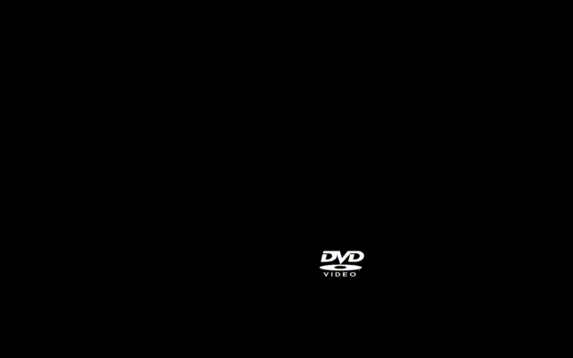

# dvdScreensaver
DVD Logo Screensaver for macOS written in swift

Made using this pong physics tutorial : https://medium.com/better-programming/how-to-make-a-custom-screensaver-for-mac-os-x-7e1650c13bd8